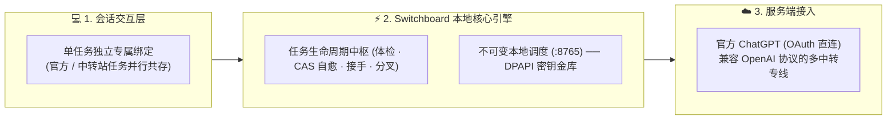

<div align="center">

# ⚡ Codex Switchboard

**Windows 本机 Codex 任务全生命周期管理与可靠性工作台**

*单任务独立切换 • 任务体检与自愈 • 一键工程接手 • 原生无损分叉 • 便携数据迁移*

[](https://github.com/carpergcollins-cpu/Codex-Switchboard)
[](https://github.com/carpergcollins-cpu/Codex-Switchboard)
[](https://github.com/carpergcollins-cpu/Codex-Switchboard)
[](https://github.com/carpergcollins-cpu/Codex-Switchboard)
[](LICENSE)

<br/>

[五大核心支柱](#-五大核心支柱) • [快速上手](#-快速上手) • [架构与安全底座](#-架构与安全底座) • [设计哲学](#-核心设计哲学) • [离线验收](#-严谨的离线回归验收)

</div>

---

## 📖 项目背景与定位

**Codex Switchboard** 是面向 Windows 本机 Codex 开发者打造的专业级任务生命周期管理与可靠性基础设施。

### 💡 为什么需要它？解决真实工程开发中的四大困境

官方 Codex 桌面端为日常编程提供了强大的 AI 辅助能力，但在高强度、长周期的实际软件工程开发中，重度用户往往会遇到以下深层次瓶颈：

1. **多任务需求冲突与“全局一刀切”**：
   - 核心生产代码需要官方旗舰模型的严谨推理，而海量单元测试与辅助脚本生成则更适合高并发的中转专线。传统工具只能全局修改配置，导致不同性质的任务无法在同一客户端内并行共存，老会话容易因配置变动而报错。
2. **长任务的脆弱性与不可逆报废**：
   - 经过数十轮深度推演、包含数万字上下文与复杂代码的长期核心任务，常因客户端偶发崩溃、网络闪断或进程死锁导致数据库投影游标滞后。任务一旦卡死在官方端便直接无法继续，前期的所有工程探索付之东流。
3. **超长会话的模型能力衰退与“信息断崖”**：
   - 随着单个会话上下文不断膨胀，大模型不可避免地出现注意力分散、遗忘早期架构约束或输出重复。然而如果直接新建会话，又面临重新交代项目全貌与技术决策的巨大繁琐工作。
4. **本地数据隔离与跨设备流转阻断**：
   - 会话历史、状态数据库与运行配置深度绑定在特定主机的特定路径下。开发者在台式机与移动笔记本之间切换时，无法平滑迁移完整的任务上下文与工作现场。

### 🛠️ Switchboard 的无侵入解题思路

Codex Switchboard 绝不另建沉重的私有云或第三方数据库，而是**以纯本地、零网络依赖的无侵入方式深耕系统底层**：
- **尊重原生数据主权**：基于 Codex 官方的底层 `thread/fork` 协议与不可变历史链，所有任务与状态权威依然完整保存在本地官方 SQLite 与 JSONL 体系中；
- **任务级细粒度解耦**：将 Provider 绑定精确到单个任务行，配合不可变本地回环调度中枢，实现真正的多线并行；
- **全生命周期安全护航**：从毫秒级只读体检、双库一致性备份、微创 CAS 自愈修复，到结构化跨会话工程接手，为每一个关键任务提供企业级的稳定性保障。

---

## 🌟 五大核心支柱

### 1. 🎯 单任务级独立切换与持久绑定
- **拒绝粗暴的全局切换**：传统工具改动配置会导致所有正在进行的会话被迫变动。Switchboard 实现了**精确到单个任务的专属持久化绑定**：
  - **任务 A** 独立绑定官方 ChatGPT 账号；
  - **任务 B** 独立绑定指定的专属中转服务或定制模型；
  - **任务 C** 走备用专线通道。
- **并行共存，永不串线**：多个不同 Provider/模型的任务在同一个桌面客户端内同时运行，互不干扰；修改全局默认配置绝不会波及已有的历史任务。

### 2. 🩺 任务深度只读体检与 CAS 游标自愈恢复
- **解决长任务报废痛点**：推进了几十轮、沉淀了数万字代码与上下文的长任务，常因客户端闪退、网络突发中断导致数据库投影游标落后或格式断层，在官方客户端内直接报错瘫痪。
- **只读健康体检**：毫秒级全链路审计原生历史分段连续性、游标与文件末尾匹配度、工具失败记录与原生持久化状态，绝不写库、不耗费 Token。
- **微创级受控自愈**：针对特定游标落后异常，引擎通过 SQLite 双库一致性快照（SQLite backup API）提供安全保障，执行原子单行 CAS (Compare-And-Swap) 游标微调校正，配合 Windows 独立后台进程授权握手，安全救活受损会话。

### 3. 🤝 跨会话一键工程接手工作流 (Handoff Workflow)
- **破除上下文膨胀瓶颈**：当一个复杂项目开发会话过长时，上下文窗口膨胀会导致模型性能衰退或遗忘关键细节。
- **两阶段严谨工程接力**：
  - **老会话整理**：原会话 AI 在原上下文中系统性梳理架构现状、已完成项与待办清单，结构化另存为交付文档（`HANDOFF.md`）；
  - **新会话只读验收**：使用全新的官方干净会话，在无历史污染的全新上下文中，严格依据只读证据逐项核验代码文件、Git 提交记录与原图，输出具有确定性依据的验收报告（`ACCEPTANCE.md`），让大型软件工程能够持续无缝演进。

### 4. 🌿 原生无损任务分叉与分支化探索 (Thread Forking)
- **像 Git Branch 一样管理对话**：在面对不确定的方案或需要做对比实验时，无需重新开荒打字。
- **数万字上下文完整继承**：基于官方底层的 `thread/fork` 协议与不可变历史游标，一键将任务分叉出新分支，完整保留祖先消息与所有代码记录；新分支自动置顶并可分配不同 Provider/模型，源任务完好保留。

### 5. 📦 企业级容器化便携迁移 (`.codexpack`)
- **跨设备无缝转移**：开发工作站到便携笔记本的自由流转。一键将任务 SQLite 投影、JSONL 历史与关联 Git 项目统一打包为标准 ZIP64 容器。
- **自动化隐私过滤与原子导入**：导出时自动扫描并剔除 DPAPI 密钥、OAuth 认证令牌与系统缓存；导入时经过 SHA-256 摘要与结构一致性校验后原子发布，非空目标绝对防覆写。

---

## 🛡️ 系统架构与安全底座

系统的分层调度模型轻量、清晰，所有核心逻辑均在本地完成闭环：



- **物理级密钥保护 (Windows DPAPI)**：拒绝任何明文保存 API Key！所有中转凭据均由 Windows 原生 DPAPI 加密存储于本地，仅限当前系统用户解密，CLI、日志与 UI 绝不暴露明文。
- **不可变内容寻址路由 (Immutable Dispatcher)**：本地回环 `127.0.0.1:8765` 调度中枢为每个服务版本生成唯一 Alias，确保老任务在任何时候都能准确访问其创建时的配置版本，杜绝配置漂移。

---

## 🚀 快速上手

### 系统要求
- **操作系统**：Windows 10 / 11 x64
- **Python 版本**：**Python 3.12+**（项目底层依赖 Python 3.12 标准库特性）
- **Codex 桌面端**：本机已安装并初始化过官方 Codex 桌面客户端

### 1. 准备运行环境
在项目根目录打开 PowerShell 执行：

```powershell
# 创建专属虚拟环境
python -m venv .venv

# 安装 PySide6 现代图形界面依赖
.\.venv\Scripts\python.exe -m pip install -r requirements-qt.txt
```

### 2. 启动图形界面 (Modern UI)
直接双击运行根目录下的启动脚本：

```text
start-switchboard-modern-ui.cmd
```

> [!TIP]
> **智能目录发现**：
> 启动器按优先级全自动识别 `CODEX_HOME` 环境变量、上次使用记录或标准 `%USERPROFILE%\.codex` 目录，开箱即用。

---

## 🎯 核心设计哲学

- **数据主权归还原生**：会话、日志与 SQLite 数据库始终归本地官方 Codex 掌管，Switchboard 绝不篡改未授权数据，不另建多余的私有数据库。
- **确定性与故障隔离**：任何分叉、体检或迁移操作均附带严格的前置探针与校验互斥锁，进程中断绝不生成脏数据。
- **零额外推理开销**：所有的目录生成、体检、本地路由与健康探针全部在本地离线闭环运行，绝不静默调用大模型产生非预期账单。

---

## 🔬 严谨的离线回归验收

本项目内置完整的工业级离线自动化测试套件与隔离 Fixture，无需连接真实外部网络即可完成机器验证：

```powershell
.\.venv\Scripts\python.exe verify_recovery.py --full --output artifacts\acceptance.json
```
- **测试覆盖**：**315 项自动化测试全部通过**（覆盖底层协议解析、独立后台 WMI 握手、CAS 恢复算法、Qt 界面与便携打包）。

---

## ⚠️ 运行行为与安全边界披露

- **本地回环路由器**：配置并启用中转服务时，调度器会在本地回环地址 `127.0.0.1:8765` 启动无副作用探针与路由转发，仅限本机进程访问，会在运行目录产生本地日志与状态文件。
- **一键接手新会话 (实验性)**：该功能专为“老会话总结交付给全新官方会话”设计，涉及两个阶段的真实模型回合调用，**会消耗实际 API Token**，使用前请确认弹窗授权。
- **数据迁移指引**：早期的 CLI `migrate` 命令针对特定的开发磁盘设计；公开用户推荐统一使用 Modern UI 的 **便携迁移 (.codexpack)** 功能。

---

## 📄 开源许可证

本项目基于 [MIT License](LICENSE) 自由开源，欢迎提交 Issue 与 Pull Request！
